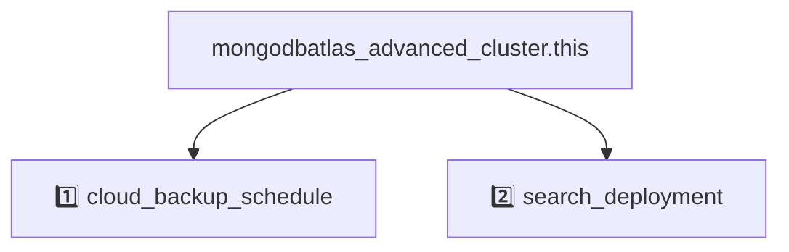

# Cluster Module
- This module maps all the attributes of [`mongodbatlas_advanced_cluster (provider 2.0.0)`](https://registry.terraform.io/providers/mongodb/mongodbatlas/latest/docs/resources/advanced_cluster) to [variables.tf](variables.tf).
- All deprecated fields are removed
- The module supports either `auto_scaling` or setting `instance_size` on root level or in each `region`


## Known Limitations (not prioritized due to limited time)
- Only supports `disk_size_gb` at root level
- No support for `disk_iops` or `ebs_volume_type`

<!-- BEGIN_DISCLAIMER -->
## Disclaimer
TODO: Removal of this disclaimer should be considered, will be addressed in future PRs if needed ,or if some additional info will be added.

<!-- END_DISCLAIMER -->

<!-- BEGIN_MODULES -->
## Modules

### Modules Instances
```sh
Module Instances
├── 1️⃣  cloud_backup_schedule
│   └── ./modules/cloud_backup_schedule
└── 2️⃣  search_deployment
    └── ./modules/search_deployment
```
### Module Definitions

```sh
cloud_backup_schedule (1️⃣)
└── mongodbatlas_search_deployment.this
search_deployment (2️⃣)
└── mongodbatlas_search_deployment.this
```

### Graph with Dependencies
Any resource without a number prefix is defined at the root level.


<!-- END_MODULES -->


<!-- BEGIN_TF_DOCS -->
## Requirements

The following requirements are needed by this module:

- <a name="requirement_terraform"></a> [terraform](#requirement\_terraform) (>= 1.6)

- <a name="requirement_mongodbatlas"></a> [mongodbatlas](#requirement\_mongodbatlas) (~> 2.0)

## Providers

The following providers are used by this module:

- <a name="provider_mongodbatlas"></a> [mongodbatlas](#provider\_mongodbatlas) (2.0.0)

## Resources

The following resources are used by this module:

- [mongodbatlas_advanced_cluster.this](https://registry.terraform.io/providers/mongodb/mongodbatlas/latest/docs/resources/advanced_cluster) (resource)
- [mongodbatlas_advanced_clusters.this](https://registry.terraform.io/providers/mongodb/mongodbatlas/latest/docs/data-sources/advanced_clusters) (data source)

## Required Inputs

The following input variables are required:

### <a name="input_cluster_type"></a> [cluster\_type](#input\_cluster\_type)

Description: Type of the cluster that you want to create. Valid values are REPLICASET/SHARDED/GEOSHARDED

Type: `string`

### <a name="input_name"></a> [name](#input\_name)

Description: Human-readable label that identifies this cluster.

Type: `string`

### <a name="input_project_id"></a> [project\_id](#input\_project\_id)

Description: Unique 24-hexadecimal digit string that identifies your project. Use the [/groups](#tag/Projects/operation/listProjects) endpoint to retrieve all projects to which the authenticated user has access.

**NOTE**: Groups and projects are synonymous terms. Your group id is the same as your project id. For existing groups, your group/project id remains the same. The resource and corresponding endpoints use the term groups.

Type: `string`

### <a name="input_regions"></a> [regions](#input\_regions)

Description: The simplest way to define your cluster topology:
- For REPLICASET: omit both `shard_number` and `zone_name`.
- For SHARDED: set `shard_number` on each region; do not set `zone_name`. Regions with the same `shard_number` belong to the same shard.
- GEOSHARDED: set `zone_name` on each region; optionally set `shard_number`. Regions with the same `zone_name` form one zone.

Type:

```hcl
list(object({
    name                    = optional(string)
    node_count              = optional(number)
    shard_number            = optional(number)
    provider_name           = optional(string)
    node_count_read_only    = optional(number)
    node_count_analytics    = optional(number)
    instance_size           = optional(string)
    instance_size_analytics = optional(string)
    zone_name               = optional(string)
  }))
```

## Optional Inputs

The following input variables are optional (have default values):

### <a name="input_accept_data_risks_and_force_replica_set_reconfig"></a> [accept\_data\_risks\_and\_force\_replica\_set\_reconfig](#input\_accept\_data\_risks\_and\_force\_replica\_set\_reconfig)

Description: If reconfiguration is necessary to regain a primary due to a regional outage, submit this field alongside your topology reconfiguration to request a new regional outage resistant topology. Forcedreconfigurations during an outage of the majority of electable nodes carry a risk of data loss if replicated writes (even majority committed writes) have not been replicated to the new primary node. MongoDB Atlas docs contain more information. To proceed with an operation which carries that risk, set **acceptDataRisksAndForceReplicaSetReconfig** to the current date.

Type: `string`

Default: `null`

### <a name="input_advanced_configuration"></a> [advanced\_configuration](#input\_advanced\_configuration)

Description: Additional settings for an Atlas cluster.

Type:

```hcl
object({
    change_stream_options_pre_and_post_images_expire_after_seconds = optional(number)
    custom_openssl_cipher_config_tls12                             = optional(list(string))
    default_max_time_ms                                            = optional(number)
    default_write_concern                                          = optional(string, "majority")
    javascript_enabled                                             = optional(bool, false)
    minimum_enabled_tls_protocol                                   = optional(string, "TLS1_2")
    no_table_scan                                                  = optional(bool)
    oplog_min_retention_hours                                      = optional(number)
    oplog_size_mb                                                  = optional(number)
    sample_refresh_interval_bi_connector                           = optional(number)
    sample_size_bi_connector                                       = optional(number)
    tls_cipher_config_mode                                         = optional(string)
    transaction_lifetime_limit_seconds                             = optional(number)
  })
```

Default:

```json
{
  "default_write_concern": "majority",
  "javascript_enabled": false,
  "minimum_enabled_tls_protocol": "TLS1_2"
}
```

### <a name="input_auto_scaling"></a> [auto\_scaling](#input\_auto\_scaling)

Description: Auto scaling config for electable/read-only specs. Enabled by default with Architecture Center recommended defaults.

Type:

```hcl
object({
    compute_enabled            = optional(bool, true)
    compute_max_instance_size  = optional(string, "M200")
    compute_min_instance_size  = optional(string, "M10")
    compute_scale_down_enabled = optional(bool, true)
    disk_gb_enabled            = optional(bool, true)
  })
```

Default:

```json
{
  "compute_enabled": true,
  "compute_max_instance_size": "M200",
  "compute_min_instance_size": "M10",
  "compute_scale_down_enabled": true,
  "disk_gb_enabled": true
}
```

### <a name="input_auto_scaling_analytics"></a> [auto\_scaling\_analytics](#input\_auto\_scaling\_analytics)

Description: Auto scaling config for analytics specs.

Type:

```hcl
object({
    compute_enabled            = optional(bool)
    compute_max_instance_size  = optional(string)
    compute_min_instance_size  = optional(string)
    compute_scale_down_enabled = optional(bool)
    disk_gb_enabled            = optional(bool)
  })
```

Default: `null`

### <a name="input_backup_enabled"></a> [backup\_enabled](#input\_backup\_enabled)

Description: Flag that indicates whether the cluster can perform backups. If set to `true`, the cluster can perform backups. You must set this value to `true` for NVMe clusters. Backup uses [Cloud Backups](https://docs.atlas.mongodb.com/backup/cloud-backup/overview/) for dedicated clusters and [Shared Cluster Backups](https://docs.atlas.mongodb.com/backup/shared-tier/overview/) for tenant clusters. If set to `false`, the cluster doesn't use backups.

Type: `bool`

Default: `true`

### <a name="input_bi_connector_config"></a> [bi\_connector\_config](#input\_bi\_connector\_config)

Description: Settings needed to configure the MongoDB Connector for Business Intelligence for this cluster.

Type:

```hcl
object({
    enabled         = optional(bool)
    read_preference = optional(string)
  })
```

Default: `null`

### <a name="input_config_server_management_mode"></a> [config\_server\_management\_mode](#input\_config\_server\_management\_mode)

Description: Config Server Management Mode for creating or updating a sharded cluster.

When configured as ATLAS\_MANAGED, atlas may automatically switch the cluster's config server type for optimal performance and savings.

When configured as FIXED\_TO\_DEDICATED, the cluster will always use a dedicated config server.

Type: `string`

Default: `null`

### <a name="input_delete_on_create_timeout"></a> [delete\_on\_create\_timeout](#input\_delete\_on\_create\_timeout)

Description: Flag that indicates whether to delete the cluster if the cluster creation times out. Default is false.

Type: `bool`

Default: `null`

### <a name="input_disk_size_gb"></a> [disk\_size\_gb](#input\_disk\_size\_gb)

Description: Storage capacity of instance data volumes expressed in gigabytes. Increase this number to add capacity.

 This value must be equal for all shards and node types.

 This value is not configurable on M0/M2/M5 clusters.

 MongoDB Cloud requires this parameter if you set **replicationSpecs**.

 If you specify a disk size below the minimum (10 GB), this parameter defaults to the minimum disk size value.

 Storage charge calculations depend on whether you choose the default value or a custom value.

 The maximum value for disk storage cannot exceed 50 times the maximum RAM for the selected cluster. If you require more storage space, consider upgrading your cluster to a higher tier.

Type: `number`

Default: `null`

### <a name="input_encryption_at_rest_provider"></a> [encryption\_at\_rest\_provider](#input\_encryption\_at\_rest\_provider)

Description: Cloud service provider that manages your customer keys to provide an additional layer of encryption at rest for the cluster. To enable customer key management for encryption at rest, the cluster **replicationSpecs[n].regionConfigs[m].{type}Specs.instanceSize** setting must be `M10` or higher and `"backupEnabled" : false` or omitted entirely.

Type: `string`

Default: `null`

### <a name="input_global_cluster_self_managed_sharding"></a> [global\_cluster\_self\_managed\_sharding](#input\_global\_cluster\_self\_managed\_sharding)

Description: Set this field to configure the Sharding Management Mode when creating a new Global Cluster.

When set to false, the management mode is set to Atlas-Managed Sharding. This mode fully manages the sharding of your Global Cluster and is built to provide a seamless deployment experience.

When set to true, the management mode is set to Self-Managed Sharding. This mode leaves the management of shards in your hands and is built to provide an advanced and flexible deployment experience.

This setting cannot be changed once the cluster is deployed.

Type: `bool`

Default: `null`

### <a name="input_instance_size"></a> [instance\_size](#input\_instance\_size)

Description: Default instance\_size in electable/read-only specs. Only used when auto\_scaling.compute\_enabled = false. Defaults to M10 if not specified.

Type: `string`

Default: `null`

### <a name="input_instance_size_analytics"></a> [instance\_size\_analytics](#input\_instance\_size\_analytics)

Description: Default instance\_size in analytics specs. Do not set if using auto\_scaling\_analytics.

Type: `string`

Default: `null`

### <a name="input_mongo_db_major_version"></a> [mongo\_db\_major\_version](#input\_mongo\_db\_major\_version)

Description: MongoDB major version of the cluster.

On creation: Choose from the available versions of MongoDB, or leave unspecified for the current recommended default in the MongoDB Cloud platform. The recommended version is a recent Long Term Support version. The default is not guaranteed to be the most recently released version throughout the entire release cycle. For versions available in a specific project, see the linked documentation or use the API endpoint for [project LTS versions endpoint](#tag/Projects/operation/getProjectLTSVersions).

 On update: Increase version only by 1 major version at a time. If the cluster is pinned to a MongoDB feature compatibility version exactly one major version below the current MongoDB version, the MongoDB version can be downgraded to the previous major version.

Type: `string`

Default: `null`

### <a name="input_paused"></a> [paused](#input\_paused)

Description: Flag that indicates whether the cluster is paused.

Type: `bool`

Default: `null`

### <a name="input_pinned_fcv"></a> [pinned\_fcv](#input\_pinned\_fcv)

Description: Pins the Feature Compatibility Version (FCV) to the current MongoDB version with a provided expiration date. To unpin the FCV the `pinned_fcv` attribute must be removed. This operation can take several minutes as the request processes through the MongoDB data plane. Once FCV is unpinned it will not be possible to downgrade the `mongo_db_major_version`. It is advised that updates to `pinned_fcv` are done isolated from other cluster changes. If a plan contains multiple changes, the FCV change will be applied first. If FCV is unpinned past the expiration date the `pinned_fcv` attribute must be removed. The following [knowledge hub article](https://kb.corp.mongodb.com/article/000021785/) and [FCV documentation](https://www.mongodb.com/docs/atlas/tutorial/major-version-change/#manage-feature-compatibility--fcv--during-upgrades) can be referenced for more details.

Type:

```hcl
object({
    expiration_date = string
  })
```

Default: `null`

### <a name="input_pit_enabled"></a> [pit\_enabled](#input\_pit\_enabled)

Description: Flag that indicates whether the cluster uses continuous cloud backups.

Type: `bool`

Default: `null`

### <a name="input_provider_name"></a> [provider\_name](#input\_provider\_name)

Description: AWS/AZURE/GCP, setting this on the root level, will use it inside of each `region`

Type: `string`

Default: `null`

### <a name="input_redact_client_log_data"></a> [redact\_client\_log\_data](#input\_redact\_client\_log\_data)

Description: Enable or disable log redaction.

This setting configures the `mongod` or `mongos` to redact any document field contents from a message accompanying a given log event before logging.This prevents the program from writing potentially sensitive data stored on the database to the diagnostic log. Metadata such as error or operation codes, line numbers, and source file names are still visible in the logs.

Use `redactClientLogData` in conjunction with Encryption at Rest and TLS/SSL (Transport Encryption) to assist compliance with regulatory requirements.

*Note*: changing this setting on a cluster will trigger a rolling restart as soon as the cluster is updated.

Type: `bool`

Default: `true`

### <a name="input_replica_set_scaling_strategy"></a> [replica\_set\_scaling\_strategy](#input\_replica\_set\_scaling\_strategy)

Description: Set this field to configure the replica set scaling mode for your cluster.

By default, Atlas scales under WORKLOAD\_TYPE. This mode allows Atlas to scale your analytics nodes in parallel to your operational nodes.

When configured as SEQUENTIAL, Atlas scales all nodes sequentially. This mode is intended for steady-state workloads and applications performing latency-sensitive secondary reads.

Type: `string`

Default: `null`

### <a name="input_replication_specs"></a> [replication\_specs](#input\_replication\_specs)

Description: List of settings that configure your cluster regions. This array has one object per shard representing node configurations in each shard. For replica sets there is only one object representing node configurations.

Type:

```hcl
list(object({
    region_configs = list(object({
      analytics_auto_scaling = optional(object({
        compute_enabled            = optional(bool)
        compute_max_instance_size  = optional(string)
        compute_min_instance_size  = optional(string)
        compute_scale_down_enabled = optional(bool)
        disk_gb_enabled            = optional(bool)
      }))
      analytics_specs = optional(object({
        disk_iops       = optional(number)
        disk_size_gb    = optional(number)
        ebs_volume_type = optional(string)
        instance_size   = optional(string)
        node_count      = optional(number)
      }))
      auto_scaling = optional(object({
        compute_enabled            = optional(bool)
        compute_max_instance_size  = optional(string)
        compute_min_instance_size  = optional(string)
        compute_scale_down_enabled = optional(bool)
        disk_gb_enabled            = optional(bool)
      }))
      backing_provider_name = optional(string)
      electable_specs = optional(object({
        disk_iops       = optional(number)
        disk_size_gb    = optional(number)
        ebs_volume_type = optional(string)
        instance_size   = optional(string)
        node_count      = optional(number)
      }))
      priority      = number
      provider_name = string
      read_only_specs = optional(object({
        disk_iops       = optional(number)
        disk_size_gb    = optional(number)
        ebs_volume_type = optional(string)
        instance_size   = optional(string)
        node_count      = optional(number)
      }))
      region_name = string
    }))
    zone_name = optional(string)
  }))
```

Default: `[]`

### <a name="input_retain_backups_enabled"></a> [retain\_backups\_enabled](#input\_retain\_backups\_enabled)

Description: Flag that indicates whether to retain backup snapshots for the deleted dedicated cluster.

Type: `bool`

Default: `true`

### <a name="input_root_cert_type"></a> [root\_cert\_type](#input\_root\_cert\_type)

Description: Root Certificate Authority that MongoDB Cloud cluster uses. MongoDB Cloud supports Internet Security Research Group.

Type: `string`

Default: `null`

### <a name="input_tags"></a> [tags](#input\_tags)

Description: Map that contains key-value pairs between 1 to 255 characters in length for tagging and categorizing the cluster.

Type: `map(string)`

Default: `{}`

### <a name="input_termination_protection_enabled"></a> [termination\_protection\_enabled](#input\_termination\_protection\_enabled)

Description: Flag that indicates whether termination protection is enabled on the cluster. If set to `true`, MongoDB Cloud won't delete the cluster. If set to `false`, MongoDB Cloud will delete the cluster.

Type: `bool`

Default: `true`

### <a name="input_timeouts"></a> [timeouts](#input\_timeouts)

Description: Timeouts for create/update/delete operations.

Type:

```hcl
object({
    create = optional(string)
    delete = optional(string)
    update = optional(string)
  })
```

Default: `null`

### <a name="input_version_release_system"></a> [version\_release\_system](#input\_version\_release\_system)

Description: Method by which the cluster maintains the MongoDB versions. If value is `CONTINUOUS`, you must not specify **mongoDBMajorVersion**.

Type: `string`

Default: `null`

## Outputs

The following outputs are exported:

### <a name="output_cluster_id"></a> [cluster\_id](#output\_cluster\_id)

Description: Unique 24-hexadecimal digit string that identifies the cluster.

### <a name="output_cluster_name"></a> [cluster\_name](#output\_cluster\_name)

Description: MongoDB Atlast cluster name.

### <a name="output_config_server_type"></a> [config\_server\_type](#output\_config\_server\_type)

Description: Describes a sharded cluster's config server type.

### <a name="output_connection_string_private_endpoint"></a> [connection\_string\_private\_endpoint](#output\_connection\_string\_private\_endpoint)

Description: n/a

### <a name="output_connection_strings"></a> [connection\_strings](#output\_connection\_strings)

Description: Collection of Uniform Resource Locators that point to the MongoDB database.

### <a name="output_create_date"></a> [create\_date](#output\_create\_date)

Description: Date and time when MongoDB Cloud created this cluster. This parameter expresses its value in ISO 8601 format in UTC.

### <a name="output_mongo_db_version"></a> [mongo\_db\_version](#output\_mongo\_db\_version)

Description: Version of MongoDB that the cluster runs.

### <a name="output_state_name"></a> [state\_name](#output\_state\_name)

Description: Human-readable label that indicates the current operating condition of this cluster.
<!-- END_TF_DOCS -->
