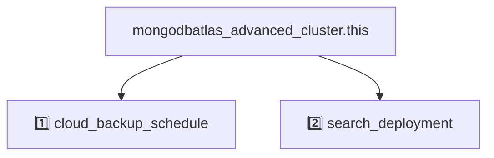

# MongoDB Atlas Cluster Module (Public Preview)

This module heavily simplifies the MongoDB Atlas cluster resource.  More granular control is provided by replacing the simplified attributes with the standard resource attributes defined in [`mongodbatlas_advanced_cluster (provider 2.0.0)`](https://registry.terraform.io/providers/mongodb/mongodbatlas/latest/docs/resources/advanced_cluster)

## Public Preview Note

The MongoDB Atlas Cluster Module (Public Preview) simplifies cluster deployments and embeds MongoDB's best practices as intelligent defaults. This preview will validate that these patterns meet the needs of most workloads without constant maintenance or rework. We welcome your feedback and contributions during this preview phase.  This module will be formally supported by MongoDB at V1 release.

## Known Limitations
- All deprecated fields are removed
- Only supports `disk_size_gb` at root level (auto-scaling is recommended and default)
- No support for `disk_iops` or `ebs_volume_type`

<!-- BEGIN_DISCLAIMER -->
## Disclaimer

One of this project's primary objectives is to provide durable modules that support non-breaking migration and upgrade paths. To achieve this, we will begin with a v0 release (public preview) focused on gathering feedback and refining the design. While this early version will help validate the approach, upgrades from v0 to v1 may not be seamless. We plan to deliver a finalized v1 release early next year with long term upgrade support.  

<!-- END_DISCLAIMER -->

<!-- BEGIN_MODULES -->
## Modules

### Modules Instances
```sh
Module Instances
├── 1️⃣  cloud_backup_schedule
│   └── ./modules/cloud_backup_schedule
└── 2️⃣  search_deployment
    └── ./modules/search_deployment
```
### Module Definitions

```sh
cloud_backup_schedule (1️⃣)
└── mongodbatlas_search_deployment.this
search_deployment (2️⃣)
└── mongodbatlas_search_deployment.this
```

### Graph with Dependencies
Any resource without a number prefix is defined at the root level.


<!-- END_MODULES -->


<!-- BEGIN_TF_DOCS -->
## Requirements

The following requirements are needed by this module:

- <a name="requirement_terraform"></a> [terraform](#requirement\_terraform) (>= 1.6)

- <a name="requirement_mongodbatlas"></a> [mongodbatlas](#requirement\_mongodbatlas) (~> 2.0)

## Providers

The following providers are used by this module:

- <a name="provider_mongodbatlas"></a> [mongodbatlas](#provider\_mongodbatlas) (2.0.0)

## Resources

The following resources are used by this module:

- [mongodbatlas_advanced_cluster.this](https://registry.terraform.io/providers/mongodb/mongodbatlas/latest/docs/resources/advanced_cluster) (resource)
- [mongodbatlas_advanced_clusters.this](https://registry.terraform.io/providers/mongodb/mongodbatlas/latest/docs/data-sources/advanced_clusters) (data source)

## Required Variables

### project_id
Description: Unique 24-hexadecimal digit string that identifies your project, for example `664619d870c247237f4b86a6`. It is found listing projects in the Admin API or selecting a project in the UI and copying the path in the URL.

**NOTE**: Groups and projects are synonymous terms. Your group id is the same as your project id. For existing groups, your group/project id remains the same. The resource and corresponding endpoints use the term groups.

Type: `string`

### name
Description: Human-readable label that identifies this cluster, for example: `my-product-cluster

Type: `string`

### cluster_type
Description: Type of the cluster that you want to create. Valid values are REPLICASET/SHARDED/GEOSHARDED

Type: `string`

## Cluster Topology `regions` (Option 1)

### regions
Description: The simplest way to define your cluster topology:
- Set `name`, for example `US_EAST_1`, see all valid [region names](https://www.mongodb.com/docs/atlas/cloud-providers-regions/).
- Set `node_count`, `node_count_read_only`, `node_count_analytics` depending on your needs.
- Set `provider_name` (AWS/AZURE/GCP) or use the "root" level `provider_name` variable if all regions share the provider_name.
- For cluster_type.REPLICASET: omit both `shard_number` and `zone_name`.
- For cluster_type.SHARDED: set `shard_number` on each region; do not set `zone_name`. Regions with the same `shard_number` belong to the same shard.
- For cluster_type.GEOSHARDED: set `zone_name` on each region; optionally set `shard_number`. Regions with the same `zone_name` form one zone.
- See auto_scaling vs manual scaling below

Note: The order in which region blocks are defined in this list determines their priority within each shard or zone. The first region gets priority 7 (maximum), the next 6, and so on (minimum 0).

Type:

```hcl
list(object({
    name                    = string
    disk_iops               = optional(number)
    disk_size_gb            = optional(number)
    ebs_volume_type         = optional(string)
    instance_size           = optional(string)
    instance_size_analytics = optional(string)
    node_count              = optional(number)
    node_count_analytics    = optional(number)
    node_count_read_only    = optional(number)
    provider_name           = optional(string)
    shard_number            = optional(number)
    zone_name               = optional(string)
  }))
```


### provider_name
Description: AWS/AZURE/GCP, setting this on the root level, will use it inside of each `region`

Type: `string`
Default: `null`

## Cluster Topology `regions` Auto Scaling

### auto_scaling
Description: Auto scaling config for electable/read-only specs. Enabled by default with Architecture Center recommended defaults.

Type:

```hcl
object({
    compute_enabled            = optional(bool, true)
    compute_max_instance_size  = optional(string, "M200")
    compute_min_instance_size  = optional(string, "M10")
    compute_scale_down_enabled = optional(bool, true)
    disk_gb_enabled            = optional(bool, true)
  })
```

Default:

```hcl
auto_scaling = {
    compute_enabled            = true
    compute_max_instance_size  = "M200"
    compute_min_instance_size  = "M10"
    compute_scale_down_enabled = true
    disk_gb_enabled            = true
  }
```


### auto_scaling_analytics
Description: Auto scaling config for analytics specs.

Type:

```hcl
object({
    compute_enabled            = optional(bool)
    compute_max_instance_size  = optional(string)
    compute_min_instance_size  = optional(string)
    compute_scale_down_enabled = optional(bool)
    disk_gb_enabled            = optional(bool)
  })
```

Default: `null`

## Cluster Topology `regions` Manual Scaling

### instance_size
Description: Default instance_size in electable/read-only specs. Only used when auto_scaling.compute_enabled = false. Defaults to M10 if not specified.

Type: `string`
Default: `null`

### instance_size_analytics
Description: Default instance_size in analytics specs. Do not set if using auto_scaling_analytics.

Type: `string`
Default: `null`

### disk_size_gb
Description: Storage capacity of instance data volumes expressed in gigabytes. Increase this number to add capacity.

 This value must be equal for all shards and node types.

 This value is not configurable on M0/M2/M5 clusters.

 MongoDB Cloud requires this parameter if you set **replicationSpecs**.

 If you specify a disk size below the minimum (10 GB), this parameter defaults to the minimum disk size value.

 Storage charge calculations depend on whether you choose the default value or a custom value.

 The maximum value for disk storage cannot exceed 50 times the maximum RAM for the selected cluster. If you require more storage space, consider upgrading your cluster to a higher tier.

Type: `number`
Default: `null`

### disk_iops
Description: Only valid for AWS and Azure instances.

#### AWS
Target IOPS (Input/Output Operations Per Second) desired for storage attached to this hardware.

Change this parameter if you:

- set `"replicationSpecs[n].regionConfigs[m].providerName" to "AWS"`.
- set `"replicationSpecs[n].regionConfigs[m].electableSpecs.instanceSize" to "M30"` or greater (not including `Mxx_NVME` tiers).

- set `"replicationSpecs[n].regionConfigs[m].electableSpecs.ebsVolumeType" to "PROVISIONED"`.

The maximum input/output operations per second (IOPS) depend on the selected **.instanceSize** and **.diskSizeGB**.
This parameter defaults to the cluster tier's standard IOPS value.
Changing this value impacts cluster cost.
MongoDB Cloud enforces minimum ratios of storage capacity to system memory for given cluster tiers. This keeps cluster performance consistent with large datasets.

- Instance sizes `M10` to `M40` have a ratio of disk capacity to system memory of 60:1.
- Instance sizes greater than `M40` have a ratio of 120:1.

#### Azure
Target throughput desired for storage attached to your Azure-provisioned cluster. Change this parameter if you:

- set `"replicationSpecs[n].regionConfigs[m].providerName" : "Azure"`.
- set `"replicationSpecs[n].regionConfigs[m].electableSpecs.instanceSize" : "M40"` or greater not including `Mxx_NVME` tiers.

The maximum input/output operations per second (IOPS) depend on the selected **.instanceSize** and **.diskSizeGB**.
This parameter defaults to the cluster tier's standard IOPS value.
Changing this value impacts cluster cost.

Type: `number`
Default: `null`

### ebs_volume_type
Description: Type of storage you want to attach to your AWS-provisioned cluster.\n\n- `STANDARD` volume types can't exceed the default input/output operations per second (IOPS) rate for the selected volume size. \n\n- `PROVISIONED` volume types must fall within the allowable IOPS range for the selected volume size. You must set this value to (`PROVISIONED`) for NVMe clusters.

Type: `string`
Default: `null`

## Cluster Topology `replication_Specs` (Option 2)

### replication_specs
Description: List of settings that configure your cluster regions. This array has one object per shard representing node configurations in each shard. For replica sets there is only one object representing node configurations.

Type:

```hcl
list(object({
    region_configs = list(object({
      analytics_auto_scaling = optional(object({
        compute_enabled            = optional(bool)
        compute_max_instance_size  = optional(string)
        compute_min_instance_size  = optional(string)
        compute_scale_down_enabled = optional(bool)
        disk_gb_enabled            = optional(bool)
      }))
      analytics_specs = optional(object({
        disk_iops       = optional(number)
        disk_size_gb    = optional(number)
        ebs_volume_type = optional(string)
        instance_size   = optional(string)
        node_count      = optional(number)
      }))
      auto_scaling = optional(object({
        compute_enabled            = optional(bool)
        compute_max_instance_size  = optional(string)
        compute_min_instance_size  = optional(string)
        compute_scale_down_enabled = optional(bool)
        disk_gb_enabled            = optional(bool)
      }))
      backing_provider_name = optional(string)
      electable_specs = optional(object({
        disk_iops       = optional(number)
        disk_size_gb    = optional(number)
        ebs_volume_type = optional(string)
        instance_size   = optional(string)
        node_count      = optional(number)
      }))
      priority      = number
      provider_name = string
      read_only_specs = optional(object({
        disk_iops       = optional(number)
        disk_size_gb    = optional(number)
        ebs_volume_type = optional(string)
        instance_size   = optional(string)
        node_count      = optional(number)
      }))
      region_name = string
    }))
    zone_name = optional(string)
  }))
```

Default:

```hcl
replication_specs = []
```


## Production Recommendations (Enabled By Default)

### advanced_configuration
Description: Additional settings for an Atlas cluster.

Type:

```hcl
object({
    change_stream_options_pre_and_post_images_expire_after_seconds = optional(number)
    custom_openssl_cipher_config_tls12                             = optional(list(string))
    default_max_time_ms                                            = optional(number)
    default_write_concern                                          = optional(string, "majority")
    javascript_enabled                                             = optional(bool, false)
    minimum_enabled_tls_protocol                                   = optional(string, "TLS1_2")
    no_table_scan                                                  = optional(bool)
    oplog_min_retention_hours                                      = optional(number)
    oplog_size_mb                                                  = optional(number)
    sample_refresh_interval_bi_connector                           = optional(number)
    sample_size_bi_connector                                       = optional(number)
    tls_cipher_config_mode                                         = optional(string)
    transaction_lifetime_limit_seconds                             = optional(number)
  })
```

Default:

```hcl
advanced_configuration = {
    default_write_concern        = "majority"
    javascript_enabled           = false
    minimum_enabled_tls_protocol = "TLS1_2"
  }
```


### backup_enabled
Description: Recommended for production clusters. Flag that indicates whether the cluster can perform backups. If set to `true`, the cluster can perform backups. You must set this value to `true` for NVMe clusters. Backup uses [Cloud Backups](https://docs.atlas.mongodb.com/backup/cloud-backup/overview/) for dedicated clusters and [Shared Cluster Backups](https://docs.atlas.mongodb.com/backup/shared-tier/overview/) for tenant clusters. If set to `false`, the cluster doesn't use backups.

Type: `bool`
Default:

```hcl
backup_enabled = True
```


### pit_enabled
Description: Recommended for production clusters. Flag that indicates whether the cluster uses continuous cloud backups.

Type: `bool`
Default:

```hcl
pit_enabled = True
```


### retain_backups_enabled
Description: Recommended for production clusters. Flag that indicates whether to retain backup snapshots for the deleted dedicated cluster.

Type: `bool`
Default:

```hcl
retain_backups_enabled = True
```


## Production Recommendations (Manually Configured)

### encryption_at_rest_provider
Description: Cloud service provider that manages your customer keys to provide an additional layer of encryption at rest for the cluster. To enable customer key management for encryption at rest, the cluster **replicationSpecs[n].regionConfigs[m].{type}Specs.instanceSize** setting must be `M10` or higher and `\"backupEnabled\" : false` or omitted entirely.

Type: `string`
Default: `null`

### redact_client_log_data
Description: Enable or disable log redaction.

This setting configures the ``mongod`` or ``mongos`` to redact any document field contents from a message accompanying a given log event before logging.This prevents the program from writing potentially sensitive data stored on the database to the diagnostic log. Metadata such as error or operation codes, line numbers, and source file names are still visible in the logs.

Use ``redactClientLogData`` in conjunction with Encryption at Rest and TLS/SSL (Transport Encryption) to assist compliance with regulatory requirements.

*Note*: changing this setting on a cluster will trigger a rolling restart as soon as the cluster is updated.

Type: `bool`
Default:

```hcl
redact_client_log_data = True
```


### tags
Description: Map that contains key-value pairs between 1 to 255 characters in length for tagging and categorizing the cluster.
We recommend setting:
Department, team name, application name, environment, version, email contact, criticality.
These values can be used for:
- Billing.
- Data classification.
- Regional compliance requirements for audit and governance purposes.

Type: `map(string)`
Default:

```hcl
tags = {}
```


### termination_protection_enabled
Description: Recommended for production clusters. Flag that indicates whether termination protection is enabled on the cluster. If set to `true`, MongoDB Cloud won't delete the cluster. If set to `false`, MongoDB Cloud will delete the cluster.

Type: `bool`
Default: `null`

## Optional Variables

### accept_data_risks_and_force_replica_set_reconfig
Description: If reconfiguration is necessary to regain a primary due to a regional outage, submit this field alongside your topology reconfiguration to request a new regional outage resistant topology. Forcedreconfigurations during an outage of the majority of electable nodes carry a risk of data loss if replicated writes (even majority committed writes) have not been replicated to the new primary node. MongoDB Atlas docs contain more information. To proceed with an operation which carries that risk, set **acceptDataRisksAndForceReplicaSetReconfig** to the current date.

Type: `string`
Default: `null`

### bi_connector_config
Description: Settings needed to configure the MongoDB Connector for Business Intelligence for this cluster.

Type:

```hcl
object({
    enabled         = optional(bool)
    read_preference = optional(string)
  })
```

Default: `null`

### config_server_management_mode
Description: Config Server Management Mode for creating or updating a sharded cluster.

When configured as ATLAS_MANAGED, atlas may automatically switch the cluster's config server type for optimal performance and savings.

When configured as FIXED_TO_DEDICATED, the cluster will always use a dedicated config server.

Type: `string`
Default: `null`

### delete_on_create_timeout
Description: Flag that indicates whether to delete the cluster if the cluster creation times out. Default is false.

Type: `bool`
Default: `null`

### global_cluster_self_managed_sharding
Description: Set this field to configure the Sharding Management Mode when creating a new Global Cluster.

When set to false, the management mode is set to Atlas-Managed Sharding. This mode fully manages the sharding of your Global Cluster and is built to provide a seamless deployment experience.

When set to true, the management mode is set to Self-Managed Sharding. This mode leaves the management of shards in your hands and is built to provide an advanced and flexible deployment experience.

This setting cannot be changed once the cluster is deployed.

Type: `bool`
Default: `null`

### mongo_db_major_version
Description: MongoDB major version of the cluster.

On creation: Choose from the available versions of MongoDB, or leave unspecified for the current recommended default in the MongoDB Cloud platform. The recommended version is a recent Long Term Support version. The default is not guaranteed to be the most recently released version throughout the entire release cycle. For versions available in a specific project, see the linked documentation or use the API endpoint for [project LTS versions endpoint](#tag/Projects/operation/getProjectLTSVersions).

 On update: Increase version only by 1 major version at a time. If the cluster is pinned to a MongoDB feature compatibility version exactly one major version below the current MongoDB version, the MongoDB version can be downgraded to the previous major version.

Type: `string`
Default: `null`

### paused
Description: Flag that indicates whether the cluster is paused.

Type: `bool`
Default: `null`

### pinned_fcv
Description: Pins the Feature Compatibility Version (FCV) to the current MongoDB version with a provided expiration date. To unpin the FCV the `pinned_fcv` attribute must be removed. This operation can take several minutes as the request processes through the MongoDB data plane. Once FCV is unpinned it will not be possible to downgrade the `mongo_db_major_version`. It is advised that updates to `pinned_fcv` are done isolated from other cluster changes. If a plan contains multiple changes, the FCV change will be applied first. If FCV is unpinned past the expiration date the `pinned_fcv` attribute must be removed. The following [knowledge hub article](https://kb.corp.mongodb.com/article/000021785/) and [FCV documentation](https://www.mongodb.com/docs/atlas/tutorial/major-version-change/#manage-feature-compatibility--fcv--during-upgrades) can be referenced for more details.

Type:

```hcl
object({
    expiration_date = string
  })
```

Default: `null`

### replica_set_scaling_strategy
Description: Set this field to configure the replica set scaling mode for your cluster.

By default, Atlas scales under WORKLOAD_TYPE. This mode allows Atlas to scale your analytics nodes in parallel to your operational nodes.

When configured as SEQUENTIAL, Atlas scales all nodes sequentially. This mode is intended for steady-state workloads and applications performing latency-sensitive secondary reads.

Type: `string`
Default: `null`

### root_cert_type
Description: Root Certificate Authority that MongoDB Cloud cluster uses. MongoDB Cloud supports Internet Security Research Group.

Type: `string`
Default: `null`

### timeouts
Description: Timeouts for create/update/delete operations.

Type:

```hcl
object({
    create = optional(string)
    delete = optional(string)
    update = optional(string)
  })
```

Default: `null`

### version_release_system
Description: Method by which the cluster maintains the MongoDB versions. If value is `CONTINUOUS`, you must not specify **mongoDBMajorVersion**.

Type: `string`
Default: `null`


## Outputs

The following outputs are exported:

### <a name="output_cluster_id"></a> [cluster\_id](#output\_cluster\_id)

Description: Unique 24-hexadecimal digit string that identifies the cluster.

### <a name="output_cluster_name"></a> [cluster\_name](#output\_cluster\_name)

Description: MongoDB Atlas cluster name.

### <a name="output_config_server_type"></a> [config\_server\_type](#output\_config\_server\_type)

Description: Describes a sharded cluster's config server type.

### <a name="output_connection_string_private_endpoint"></a> [connection\_string\_private\_endpoint](#output\_connection\_string\_private\_endpoint)

Description: n/a

### <a name="output_connection_strings"></a> [connection\_strings](#output\_connection\_strings)

Description: Collection of Uniform Resource Locators that point to the MongoDB database.

### <a name="output_create_date"></a> [create\_date](#output\_create\_date)

Description: Date and time when MongoDB Cloud created this cluster. This parameter expresses its value in ISO 8601 format in UTC.

### <a name="output_mongo_db_version"></a> [mongo\_db\_version](#output\_mongo\_db\_version)

Description: Version of MongoDB that the cluster runs.

### <a name="output_state_name"></a> [state\_name](#output\_state\_name)

Description: Human-readable label that indicates the current operating condition of this cluster.
<!-- END_TF_DOCS -->
